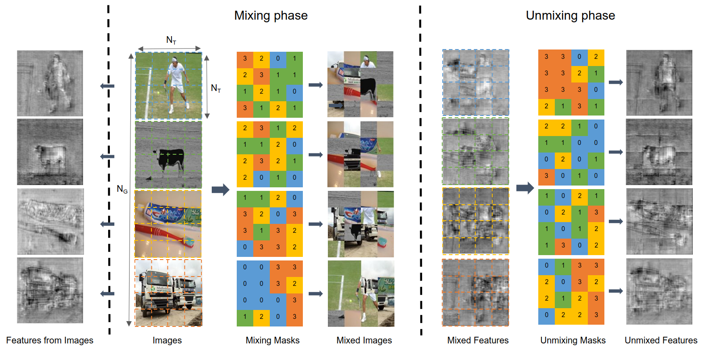
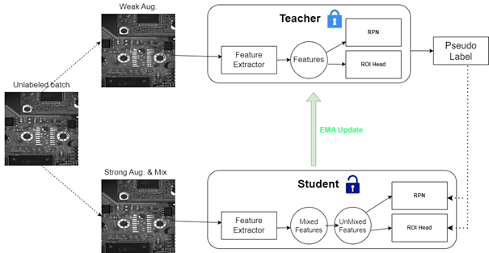

# MUM : Mix Image Tiles and UnMix Feature Tiles for Semi-Supervised Object Detection

<p align="center">

          </p>

<p align="center">

          </p>
# Installtion & Setup
We follow the installation precess of Unbiased Teacher official repo (https://github.com/facebookresearch/unbiased-teacher)

## Download the code

- git clone https://github.com/anhTuan24/Semi_Mix_Unmix.git

### Prerequisites

- Linux hoặc macOS với Python ≥ 3.6
- PyTorch ≥ 1.5 và torchvision phù hợp với phiên bản Pytorch cài đặt

### Xây dựng Detectron2 cho mã nguồn

- Chúng tôi phát hiện rằng phiên bản mới nhất (v0.6) của Detectron2 gây ra lỗi với mã nguồn của chúng tôi.
- Do đó, vui lòng cài đặt phiên bản tương ứng (v0.5) của Detectron2 như sau:

```shell
# get the Detectron2 v0.5 package
wget https://github.com/facebookresearch/detectron2/archive/refs/tags/v0.5.zip

# unzip
unzip v0.5.zip

# install
python -m pip install -e detectron2-0.5

```

### Install requirements

```shell
pip install -r requirements.txt
```

# Train

Chúng tôi sử dụng google colab pro với cấu hình (GPU T4 Tesla, VRAM 16GB)

- Huấn luyện MUM với 20% dữ liệu của chúng tôi (ResNet-50)

```shell
python train_net.py \
      --num-gpus 1 \
      --config configs/mum_configs/coco_custom.yaml \
```

## Inference

- Register dataset

```shell
from detectron2.data.datasets import register_coco_instances

register_coco_instances("YOUR_TRAIN_DATASET", {}, "***PATH TO ANNOTATION JSON FILE***", "***PATH TO IMG FOLDER***")
register_coco_instances("YOUR_TEST_DATASET", {}, "***PATH TO ANNOTATION JSON FILE***", "***PATH TO IMG FOLDER***")
```

- config model

```shell
from detectron2.config import get_cfg

cfg = get_cfg()

cfg.merge_from_file("./configs/Base-RCNN-FPN.yaml")
cfg.MODEL.WEIGHTS = os.path.join("./output/model_best.pth")
cfg.MODEL.ROI_HEADS.NUM_CLASSES = 1
cfg.MODEL.ROI_HEADS.SCORE_THRESH_TEST = 0.50   # Testing threshold
cfg.DATASETS.TRAIN = ("YOUR_TRAIN_DATASET", )
cfg.DATASETS.TEST = ("YOUR_TEST_DATASET", )
```

- Predict image

```shell
from detectron2.data import DatasetCatalog
import cv2, random
from google.colab.patches import cv2_imshow
from detectron2.utils.visualizer import Visualizer
from ubteacher.engine.trainer import CustomPredictor

dataset_dicts = DatasetCatalog.get("YOUR_TEST_DATASET")
predictor = CustomPredictor(cfg)

for d in random.sample(dataset_dicts, 2):
    im = cv2.imread(d["file_name"])
    outputs = predictor(im)
    v = Visualizer(im[:, :, ::-1],
                   scale=1
    )
    out = v.draw_instance_predictions(outputs["instances"].to("cpu"))
    cv2_imshow(out.get_image()[:, :, ::-1])
```
